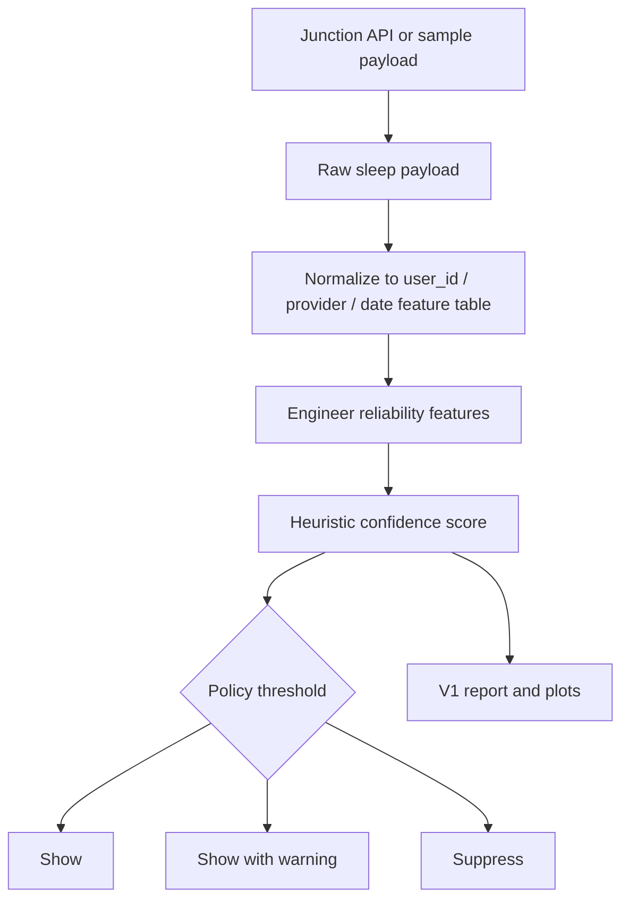
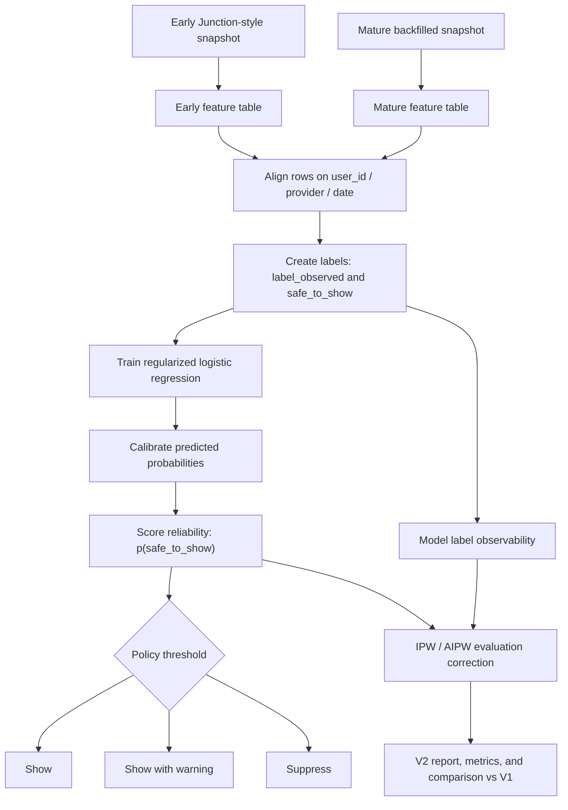

# V1 and V2 Flow Diagrams

## V1 Flow

### V1 Summary

- Ingest Junction-style sleep data
- Build a daily feature table
- Compute completeness, baseline, stability, and provider-agreement features
- Combine them into a hand-tuned confidence score
- Map that score into `show`, `show_with_warning`, or `suppress`

## V2 Flow

### V2 Summary

- Compare an early snapshot to a later mature snapshot
- Label whether an early signal stayed close enough to the mature version
- Train a calibrated reliability model
- Convert predicted probabilities into a product policy
- Use IPW and AIPW to correct evaluation when only some rows become verifiable later

## Interview Framing

### V1

`V1` is a heuristic reliability policy:
- useful for demonstrating product reasoning
- highly interpretable
- not learned from an explicit target

### V2

`V2` is a learned reliability model:
- turns reliability into a supervised learning problem
- keeps the output product-facing
- uses causal methods only to debias evaluation, not to replace the predictor
